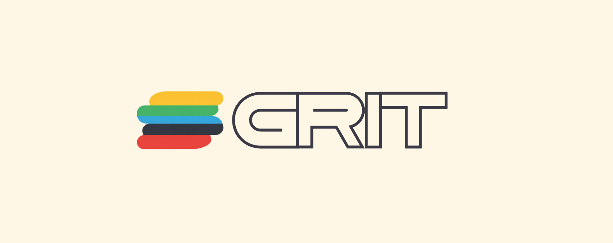

<div align="center">



<br>

**A self-hosted gym & body-weight tracker you actually own.**

Plan your week, run guided workouts, track every set and your body weight over time —
on your phone, synced across devices, behind your own passkey login.
No account on someone else's server, no subscription, no ads. Just `docker compose up`.

<br>

[](LICENSE)


<br>

[](https://github.com/MatiasBalbontin/grit/stargazers)
[](https://github.com/MatiasBalbontin/grit/issues)

</div>

> **Note:** Grit is a modified fork of the excellent [openGym](https://github.com/DuarteSantos8/openGym) project created by Duarte Santos. It includes a complete visual rebranding, native Android builds, and a dedicated automated Personal Records (PR) module.

## Why

Most workout apps lock your data behind a login on their servers, nag you to upgrade, or
disappear when the startup does. Grit is the opposite: **it runs on your box, your data
stays in a folder you control, and it's yours to fork.** It still feels modern — installable
as a home-screen app, passkey sign-in, offline support, sync across your phone and laptop.

## Features

- 🏆 **Smart Personal Records (PRs)** — specialized module to manually or automatically track your PRs based on volume and sets.
- ⚖️ **Body-weight tracking** — interactive chart with a goal line you set, gains/losses colored by whether they move toward it
- 🏋️ **Weekly plan** — a routine per weekday, over a library of **1,324 exercises** (searchable, with animated demos)
- 🗓️ **Reschedule any day** — sick, missed a session, or fewer gym days this week? Move a workout to another day without touching your weekly plan
- ▶️ **Guided workouts** — it knows what day it is and starts today's session; asks your body weight first, pre-fills your weights from last time, rest timer, PR detection, per-exercise weight tracking
- ☀️ **The screen stays awake while you train** — no unlocking the phone and finding your place again between every set. On for as long as a workout is running, released the moment you finish it, and switchable off in Settings
- 🔗 **Supersets** — build them, and log them back-to-back with a rest only after the pair
- ⏱️ **Timed exercises** — planks, hangs, wall sits and loaded carries are logged by time, not reps, with a work timer that counts the set itself (separate from the rest timer) and logs the time you actually held. They can carry weight too
- 📈 **Progression that follows a rule** — pick one per routine, override it per exercise: linear, **Greyskull LP** (AMRAP top set, double jumps, 10 % resets), double progression through a rep range, or adding time. Your weights are already right when the session opens, and every target says *why* it's that number. Missed reps never advance the load, stalls trigger a deload, and bodyweight exercises progress in reps instead
- 💪 **Estimated 1RM** — per exercise, from your best eligible set (it names which one), with its own progress curve and a calculator for sets you haven't done. Won't guess above 12 reps
- 🎯 **Effort per set, in your scale** — an optional third column rating how hard a set was, as **RIR** (reps left in the tank) or **RPE** (the same judgement on a 10-point scale). Off by default; each set keeps the scale it was logged with, and nothing else reads the value — your progression and 1RM are unaffected
- ↔️ **Reps per side** — for lunges, single-arm rows and the rest. You log the total, the app shows the split ("8 per side"), and the target steps in twos so it never lands on a number one side can't have
- 🏃 **Cardio** — log time + speed, not just weight × reps
- 📥 **Bring your history with you** — import from **FitNotes**, **Strong** and **Hevy**, or body weight straight out of an **Apple Health** export.
- 📦 **Yours to keep** — one-tap JSON export/import, guest mode, **no telemetry**
- 📱 **Standalone Android app** — the whole tracker as a sideloadable APK: no account, no server, data on the phone, native workout reminders.

## Quick start (self-host)

You need [Docker](https://docs.docker.com/get-docker/) with Compose.

```bash
git clone https://github.com/MatiasBalbontin/grit
cd grit
cp .env.example .env
docker compose up -d --build
```

Open **http://localhost:8080**, tap **Create profile**, and you're in. First launch downloads
the exercise media (~140 MB) once. 

> Want it reachable from your phone over the internet with passkeys? You'll need an HTTPS
> domain — a two-line change in `.env`. See **[docs/SELF_HOSTING.md](docs/SELF_HOSTING.md)**.

## Mobile app (no server at all)

The same codebase also builds a **standalone mobile app** (Capacitor): no account, no sync,
no backend — everything stays on the phone, with native workout-day reminders and share-sheet
backups. 

- **Android:** Check the [GitHub Releases](https://github.com/MatiasBalbontin/grit/releases) to download the pre-compiled APK and sideload it.
- **iPhone:** Apple doesn't allow installing apps outside the App Store, so there is no iOS download. Self-host and add it to your home screen from Safari (it's a full PWA).

## How it works

```
┌─────────────┐        ┌──────────────────────────────┐
│  Your phone │──HTTPS─▶│  web  (nginx)                │
│  / laptop   │        │   ├─ serves the built app    │
└─────────────┘        │   └─ proxies /api ──────────┐│
                       └──────────────────────────────┘│
                                                        ▼
                                        ┌──────────────────────────┐
                                        │  api  (Node + WebAuthn)  │
                                        │   └─ ./data (JSON files) │
                                        └──────────────────────────┘
```

## Your data

Lives in `./data` on your host: `db.json` (profiles + public passkeys), `state-<user>.json`
(each user's plan, workouts, body weight, settings), and `secret` (the session-cookie key).
**Back up `./data` and you've backed up everything.** Passkey private keys never touch the
server — they stay in your phone's secure hardware / your password manager.

## Configuration

All via `.env` (see `.env.example`):

| Variable      | What it is                                           | Default                 |
|---------------|------------------------------------------------------|-------------------------|
| `RP_ID`       | Hostname passkeys are bound to                       | `localhost`             |
| `ORIGIN`      | Full URL the app is served from                      | `http://localhost:8080` |
| `WEB_PORT`    | Host port for the web UI                             | `8080`                  |
| `RP_NAME`     | Name shown in the passkey prompt                     | `Grit`                  |
| `ADMIN_UIDS`  | User ids that get the admin dashboard (comma-separated) | *(none)*             |
| `INVITE_ONLY` | Require an invite code to create a profile           | *(off)*                 |


## License

[GNU AGPL v3.0](LICENSE) — free and open source. You can self-host, use, modify and share it;
if you run a modified version as a network service, you must offer that version's source under
the same license. Nobody can turn Grit into a closed, proprietary product.

Exercise images/GIFs are fetched from the upstream dataset and keep their own terms — see [NOTICE.md](NOTICE.md) for full details on this fork and the AGPL inheritance.
